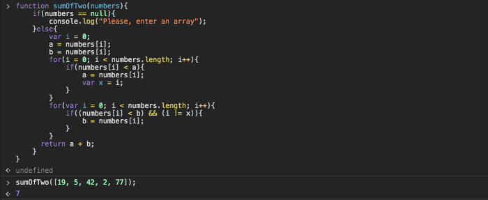
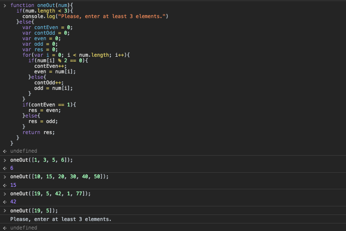

### Calculate Daily Pay

``` 
function dailyPay(){
    var dogWalks = [4, 5, 2, 2, 6, 1, 3];
    for(var i = 0; i < dogWalks.length; i++){
        console.log("Trisha earned $" + (dogWalks[i] * 22) + " today!");
    }
}
```


### YELLING

```
function yelling(sentence){
    console.log(sentence.toUpperCase());
}
```


### Calculate Total Pay

```
function totalPay(){
    var dogWalks = [4, 5, 2, 2, 6, 1, 3];
    var total = 0;
    for(var i = 0; i < dogWalks.length; i++){
        total = total + (dogWalks[i] * 22);
    }
    return total;
}
```


### Best Client

```
function bestClient(){
    var hourlyPay = [22, 17, 29, 16, 18];
    var bestPay = 0;
     for(var i = 0; i < hourlyPay.length; i++){
         if(hourlyPay[i] > bestPay){
             bestPay = hourlyPay[i];
         }
     }
    return bestPay;
}
```


### Sum of Two

```
function sumOfTwo(numbers){
    if(numbers == null){
        console.log("Please, enter an array");
    }else{
        var i = 0;
        a = numbers[i];
        b = numbers[i];
        for(i = 0; i < numbers.length; i++){
            if(numbers[i] < a){
                a = numbers[i];
                var x = i;
            }
        }
        for(var i = 0; i < numbers.length; i++){
            if((numbers[i] < b) && (i != x)){
                b = numbers[i];
            }
        }
      return a + b;
    }
}
```


### Find the Odd (or Even) One Out

```
function oneOut(num){
  if(num.length < 3){
    console.log("Please, enter at least 3 elements.")
  }else{
    var contEven = 0;
    var contOdd = 0;
    var even = 0;
    var odd = 0;
    var res = 0;
    for(var i = 0; i < num.length; i++){
      if(num[i] % 2 == 0){
        contEven++;
        even = num[i];
      }else{
        contOdd++;
        odd = num[i];
      }
    }
    if(contEven == 1){
      res = even;    
    }else{
      res = odd;
    }
    return res;
  }
}
```

