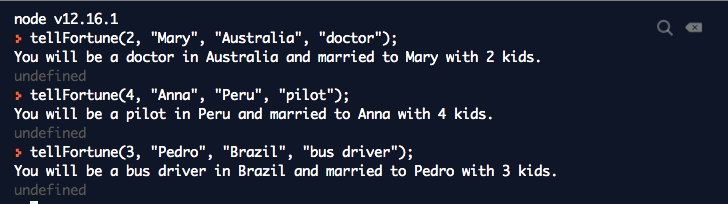
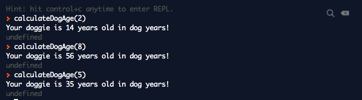
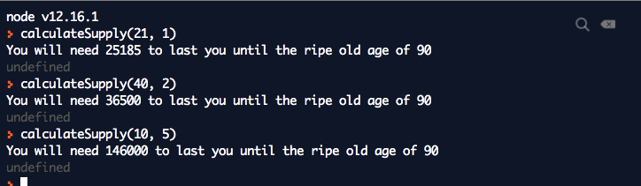
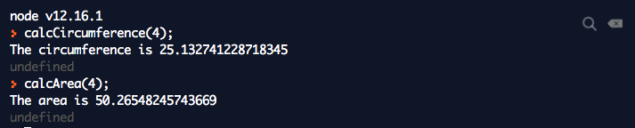
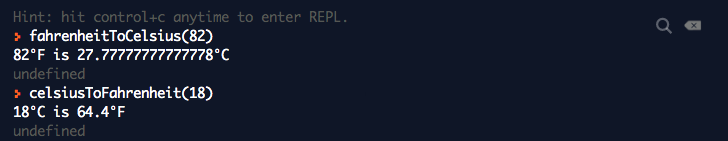

### Invoke a Function:

* Sum

  
  
* Equations 

  

* Random 

  

### Try it out

  

La funcion no tiene retorno.

### You Do

* Say Something 


* Show Favorites 


* Calculate Age 


## Exercises: Functions

The Fortune Teller

```
function tellFortune(children, partner, location, job){
  console.log("You will be a " + job + " in " + location + " and married to " + partner + " with " + children + " kids.")
}
```


The Puppy Age Calculator

```
function calculateDogAge(puppyAge){
  var dogYears = puppyAge * 7;
  console.log("Your doggie is " + dogYears + " years old in dog years!")
}
```


The Lifetime Supply Calculator

```
function calculateSupply(age, amountDay){
  var maxAge = 90;
  var amount = (maxAge - age) * 365 * amountDay;
  console.log("You will need " + amount + " to last you until the ripe old age of " + maxAge);
}
```


The Geometrizer

```
function calcCircumference(radius){
  circumference = 2 * Math.PI * radius;
  console.log("The circumference is " + circumference);
}

function calcArea(radius){
  area = Math.PI * Math.pow(radius, 2);
  console.log("The area is " + area);
}
```


The Temperature Converter

```
function celsiusToFahrenheit(celsius){
  var f = (celsius / 5) * 9 + 32;
  console.log(celsius + "°C is " + f + "°F");
}
function fahrenheitToCelsius(fahrenheit){
  var c = (fahrenheit - 32) * 5 / 9;
  console.log(fahrenheit + "°F is " + c + "°C");
}
```

