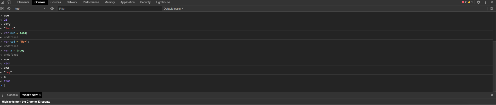
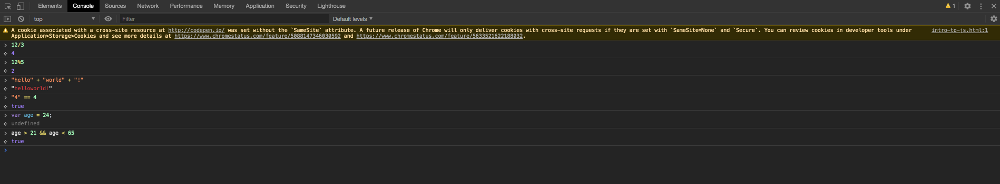
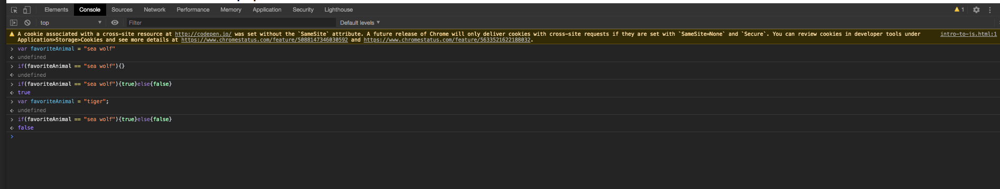

### History of JavaScript
   May ——> Mayhem
   
   Butterfly ——-> Butter
   
### Data Types Jigsaw
Es una propiedad que indica que a una variable no se le ha asignado ningun valor. Se la puede usar en una condicion por ejemplo:

    ```
    if(x == undefined){
	    //Algo pasa
    }
    ```
### Console Practice
   Cuando se llama a la variable "name" el resultado es una cadena vacia.
   Cuando se llama a la variable "quantity" no hay resultado.
   
### Console Practice #2
   * Asigne un numero entero para 'age' y un Strign para 'city'.
   
   * 
   
### Partner Challenge


     
### Conditional -Your Turn


