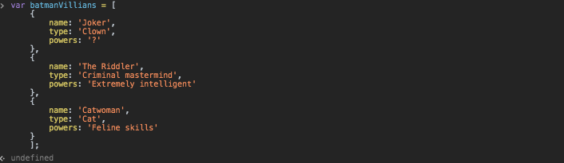
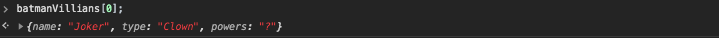
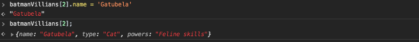
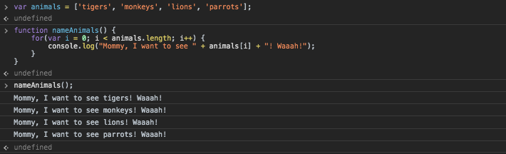

### Warm Up

* 

* 

* 

### Medium Heat: Annoying Zoo Kid

### Spicy: Pet Paragraph

* 'res' only logs to the last pet, because the paragraph variable is inside the 'for' and is overwritten in each loop.
