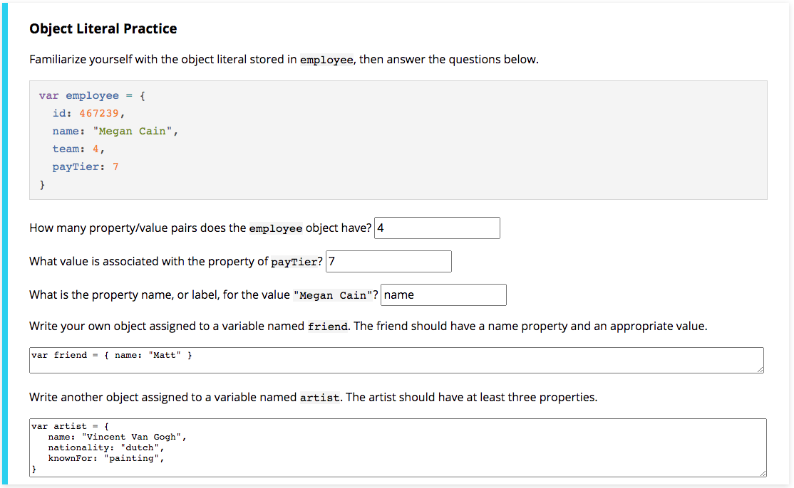
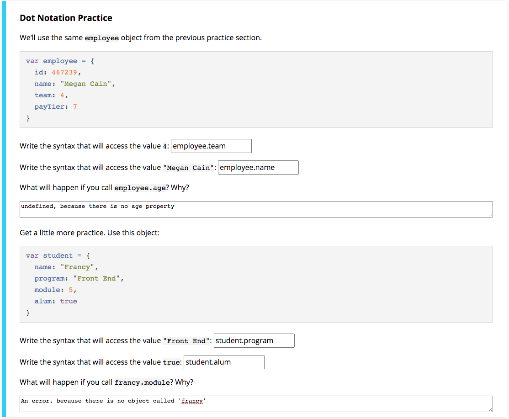
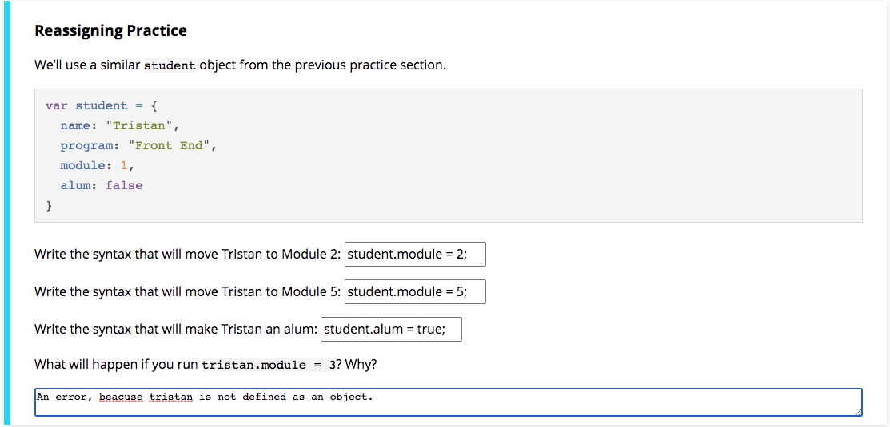
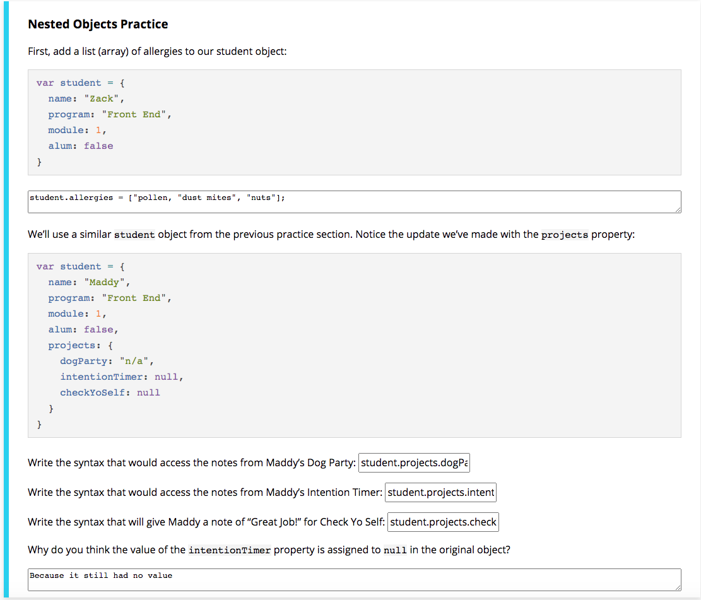

### Object Literals



### Dot Notation



### Reassigning Properties



### Nested Objects



### Objects as Arguments

```
var melissa = {
  name: "Melissa",
  program: "Front End",
  module: 1,
  alum: false
}
var zack = {
  name: "Zack",
  program: "JS",
  module: 2,
  alum: true
}
var joe = {
  name: "Joe",
  program: "C++",
  module: 1,
  alum: false
}
function message(student) {
  console.log(student.name + " is one of our awesome " + student.program + " students, currently in module " + student.module + "!");
}
```
