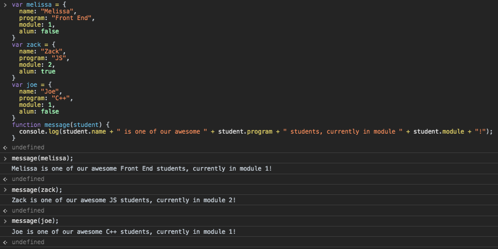
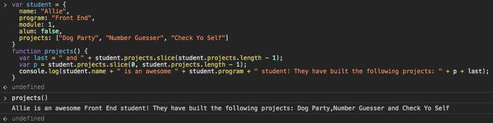

### Object Literals


### Dot Notation


### Reassigning Properties


### Nested Objects


### Objects as Arguments

```
var melissa = {
  name: "Melissa",
  program: "Front End",
  module: 1,
  alum: false
}
var zack = {
  name: "Zack",
  program: "JS",
  module: 2,
  alum: true
}
var joe = {
  name: "Joe",
  program: "C++",
  module: 1,
  alum: false
}
function message(student) {
  console.log(student.name + " is one of our awesome " + student.program + " students, currently in module " + student.module + "!");
}
```



### Challenge

```
var student = {
  name: "Allie",
  program: "Front End",
  module: 1,
  alum: false,
  projects: ["Dog Party", "Number Guesser", "Check Yo Self"]
}
function projects() {
  var last = " and " + student.projects.slice(student.projects.length - 1);
  var p = student.projects.slice(0, student.projects.length - 1);
  console.log(student.name + " is an awesome " + student.program + " student! They have built the following projects: " + p + last);
}
```

